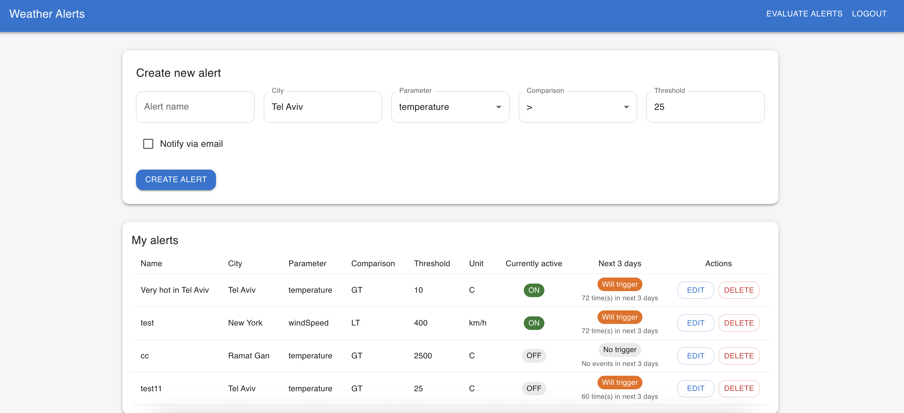
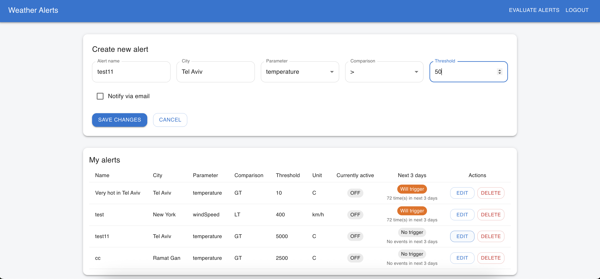

# Weather Alerts – Fullstack Assignment

This project implements a complete weather alert system using FastAPI for the backend and React (Vite + Material UI) for the frontend.

The system allows users to register, log in, create alerts based on weather conditions, evaluate alerts, and check forecast‑based predictions for the next 3 days.

The implementation focuses on correctness, clarity, and minimalism while fully covering the functional requirements of the assignment.

---

## Backend (FastAPI)

### Features

- User registration and authentication (email + password, JWT‑based).
- CRUD alerts: create, list, update (via delete+create), delete.
- Evaluate alerts logic (checks current forecast + next 72 hours).
- Weather service using Tomorrow.io API.
- Status endpoint returning:
  - Whether the alert is active *right now*.
  - How many forecast slots will trigger it in the next 3 days.
- Basic email notification flag (UI + DB) — backend prepared but no real email service plugged in.

---

## Frontend (React + Vite + Material UI)

### Features

- Login form.
- Create/edit/delete alerts.
- Validation errors inside the form (required fields, positive threshold).
- API errors displayed at top of page (invalid city, rate limits, backend issues).
- Alerts table showing:
  - All user alerts
  - Whether currently active (ON/OFF)
  - Next 3‑day triggers
  - Edit/Delete buttons
- “Evaluate Alerts” button calling backend evaluation logic on demand.

---

## Setup Instructions

### 1. Clone the repository

```bash
git clone https://github.com/<your-user>/weather-alerts-homework.git
cd weather-alerts-homework
```

---

## 2. Backend Setup (FastAPI)

```bash
cd backend
python -m venv .venv
source .venv/bin/activate   # Windows: .venv\Scripts\activate
pip install --upgrade pip
pip install -r requirements.txt
```

### Create `.env` file inside **backend/**:

```
TOMORROW_API_KEY=your_api_key_here
SECRET_KEY=your_secret_here
```

### Run backend

```bash
uvicorn app.main:app --reload
```

The API will run at:

```
http://localhost:8000
```

### Add a user via Swagger

Go to:

```
http://localhost:8000/docs
```

Use the `/auth/register` endpoint to create a new test user.

Then log in via `/auth/login` to get your JWT token.

---

## 3. Frontend Setup (React + Vite)

```bash
cd ../frontend
npm install
npm run dev
```

The app will run at:

```
http://localhost:5173
```

---

## How Alert Evaluation Works

The backend retrieves weather data (current + next 72 hours) from Tomorrow.io and evaluates:

1. Whether the alert is currently active.
2. How many future 1‑hour forecast slots match the alert condition.

This data is returned in `/alerts/status` and displayed in the UI.

---

## Notes & Assumptions

- Email notifications: UI + DB support exists, but no email delivery service was implemented due to scope/time.
- Editing alerts is implemented as delete+create (minimalistic approach).
- The weather API has strict rate limits; rapid repeated evaluations may return 429 errors.
- Input validation is split:
  - Frontend: form validation (required fields, numeric threshold).
  - Backend: city validation via Tomorrow.io API.

---

## Screenshots




